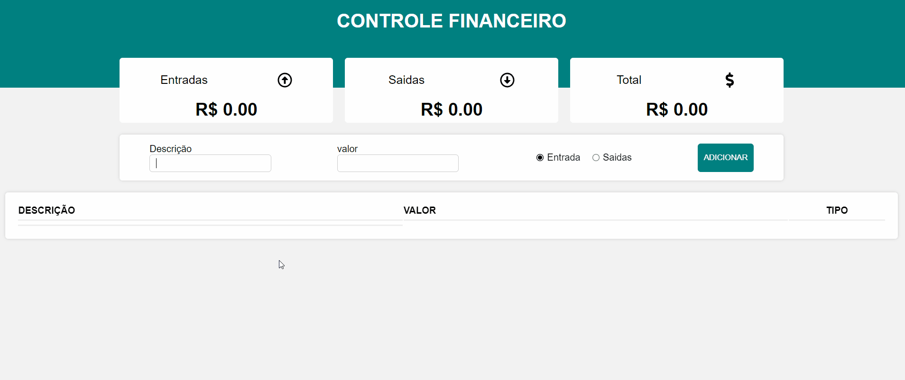

# 
**Controle Financeiro**

 Esse projeto é um aplicativo de controle financeiro, onde pode adicionar entradas e saidas financeiras.  

 > Status: Finalizado!

<a href="#features">Features</a> • 
<a href="#requisitos">Pré Requisitos</a> • 
<a href="#tecnologias">Tecnologias</a> • 
<a href="#autor">Autor</a> • 

<h1 align="center">

> [Testar Controle Financeiro](https://juniorcaus.github.io/controle-financeiro/)
</h1>

# Features 
- [x] Criando um aplicativo para controle financeiro, onde possui entradas, saidas e total da receita financeira.
- [x] Tem a opção de adicionar a descrição do item, valor e se é uma entrada ou saida financeira
- [x] Criando uma lista de itens adicionados, tendo como remove-los, na qual é diminuido do saldo total

 

# Requisitos 

Antes de começar, você vai precisar ter instalado em sua máquina as seguintes ferramentas:
 
 [Git](https://git-scm.com), [Node.js](https://nodejs.org/en/).

Você também vai precisar configurar o ambiente para desenvolvimento React no seu PC [React](https://pt-br.reactjs.org/docs/create-a-new-react-app.html).

Além disto é bom ter um editor para trabalhar com o código como [VSCode](https://code.visualstudio.com/).

 

# Tecnologias

As seguintes tecnologias foram usadas durante a construção do projeto:

 - [JavaScript]()
 - [ReactJS]()
 - [GRID]()
 - [styled-components]()

 

# Autor

 - Feito por Milton Caus  
 
 → [Linkedln.](https://www.linkedin.com/in/miltoncaus/)

